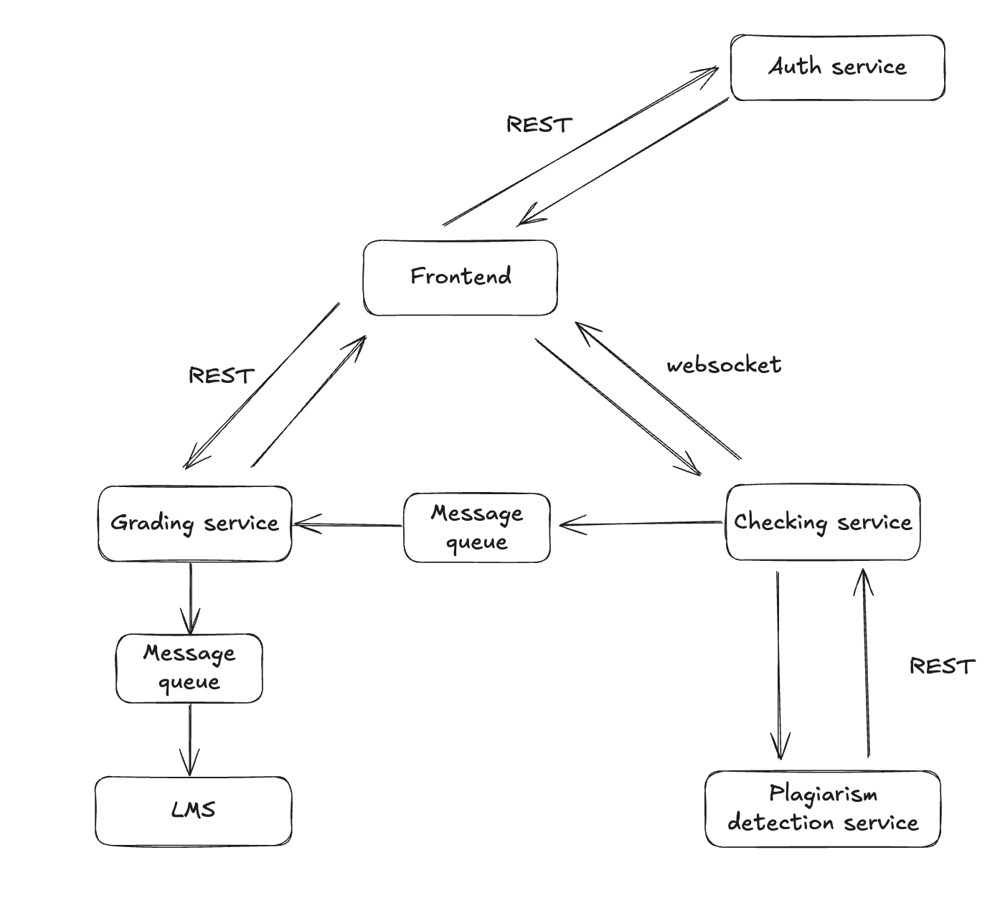

## Электронный учебный курс

1. *Фронтенд*
2. *Сервис авторизации и аутентификации* (скорее всего, у университета уже есть некий сервис авторизации, лучше авторизоваться через него)
3. *Сервис запуска и тестирования решений*. Функционал довольно универсальный, поэтому есть смысл вынести в отдельный сервис, чтобы в дальнейшем можно было использовать и для других курсов
4. *Сервис оценивания*. Может аггрегировать информацию от сервиса запуска решений по отдельным пользователям, на основе этой информации по определенным формулам/алгоритмам рассчитывать оценки и прогресс по курсу и отдавать данные фронту и LMS. Также будет хранить сами задания и отдавать их фронту
5. *Сервис проверки на плагиат*
6. *LMS*. В нашу систему не входит, но с ним будем интегрироваться, поэтому отметим

Интеграции:
1. *Фронт - сервис авторизации*. Синхронная, так как необходимо отправить  данные и дождаться токена для дальнейшей работы
2. *Фронт - сервис запуска решений*. Асинхронная, можно сделать через WebSocket. Проверка решений, скорее всего, будет занимать продолжительное время, поэтому нет смысла ждать. Можно просто получить уведомление по её окончании
3. *Сервис запуска решений - сервис оценивания*. Асинхронная, можно сделать через очередь сообщений. Ждать ответа смысла нет, так как сервису запуска решений не нужна информация о том, принял его сообщения сервис грейдинга или нет.
4. *Сервис оценивания - фронтенд*. Скорее всего, оценки по курсу будут располагаться где-то на отдельной странице, поэтому достаточно синхронной интеграции. Используем REST, при открытии страницы с прогрессом по курсу отправляем GET-запросы и получаем нужную инфу. То же самое с заданиями: достаточно сделать ручки для создания / удаления / редактирования / получения заданий.
5. *Сервис оценивания - LMS*. Асинхронная, можно сделать через очередь сообщений. LMS считает данные, когда будет необходимо
6. *Сервис запуска решений - Сервис проверки на плагиат*. Пожалуй, лучше сделать синхронную интеграцию, так как запускать решение, не прошедшее проверку на плагиат нет смысла

