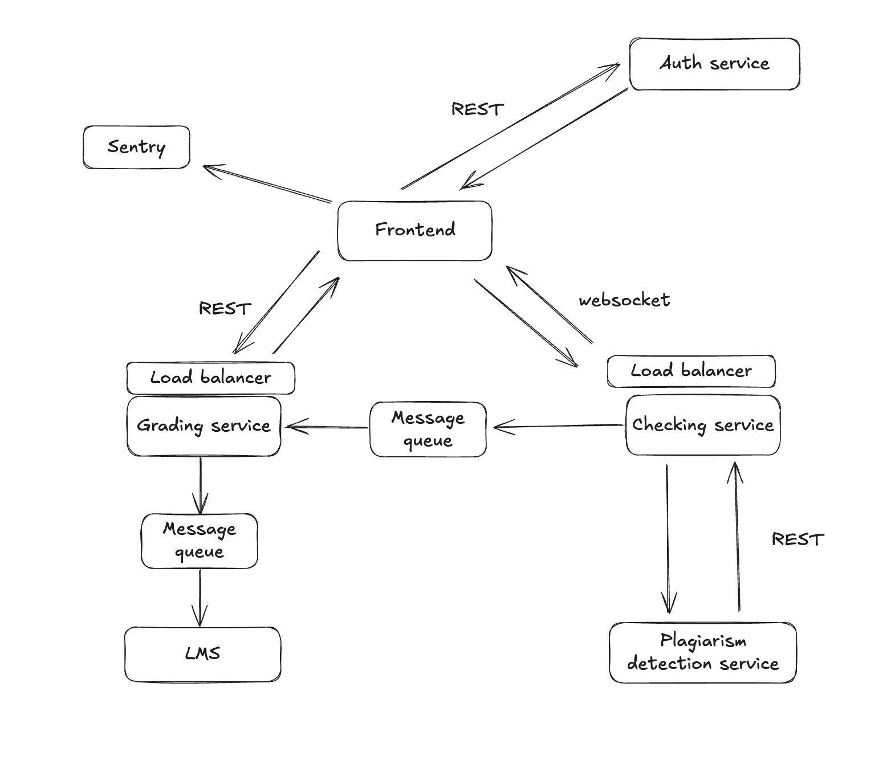

P.S. У меня получилась не очень большая система, а в примере описано много подходящих компонентов. Поэтому я скорее прошелся по компонентам из примера, убрал ненужные, оставшиеся подредактировал под реалии своей системы.

### **1. Обязательные компоненты (MUST)**

| Компонент         | Обоснование                                                                 | Реализация (опционально)                     |
|-------------------|-----------------------------------------------------------------------------|--------------------------------------------|
| **Load Balancer** | Распределение трафика между инстансами сервисов. Без него горизонтальное масштабирование невозможно | Yandex Load Balancer |
| **CI/CD**         | Автоматизация развертывания. Без нее уменьшится T2M и увеличится риск человеческого фактора на ПРОД | GitLab CI / Github Actions |
| **Сбор метрик** | Снятие таких-то метрик, трекаем такие-то трейсы | Пишем запросы и храним метрики с помощью Prometheus, отображаем визуально на бордах Grafana      |
| **Резервное копирование** | Гарантия восстановления данных (RPO < 1 мин). Требование 152-ФЗ. | Daily snapshots S3 + WAL-G для PostgreSQL |

---

### **2. Рекомендуемые компоненты (SHOULD)**

| Компонент          | Обоснование                                                                 | Реализация (опционально)                    |
|--------------------|-----------------------------------------------------------------------------|--------------------------------------------|
| **Feature Flags**  | Безопасный rollout фич                 | LaunchDarkly для управления в runtime       |
| **Мониторинг ошибок**  | Собираем и храним инфу об ошибках для облегчения поддержки сервиса                 |    Sentry   |

### Обновленный HLD

